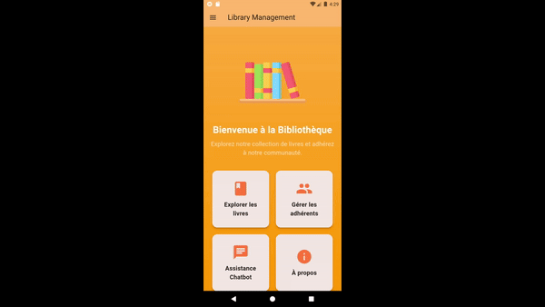
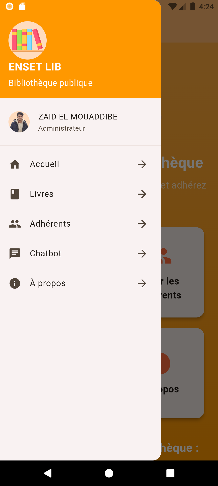
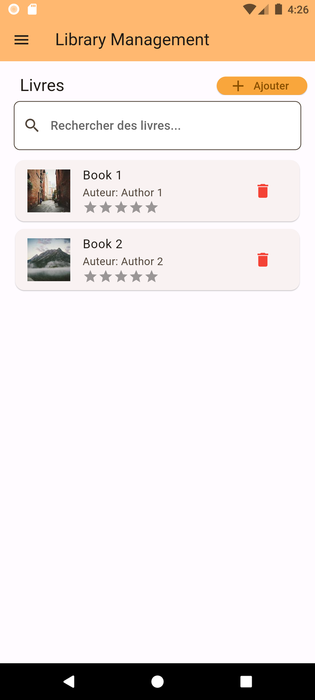
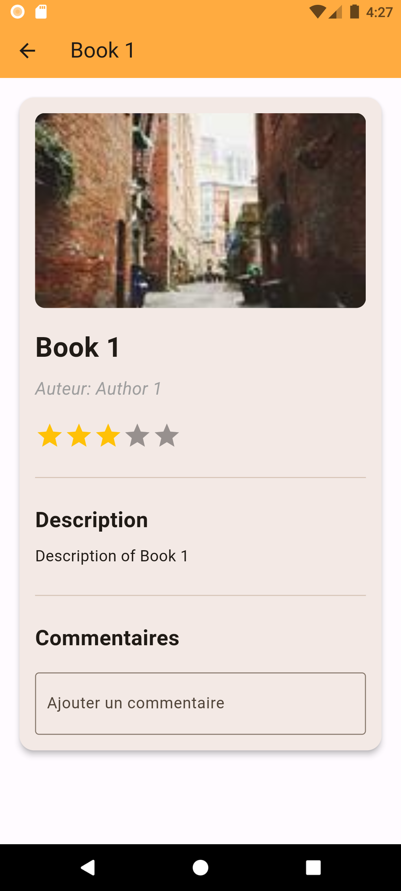
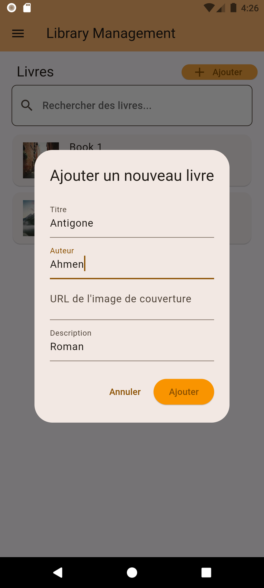
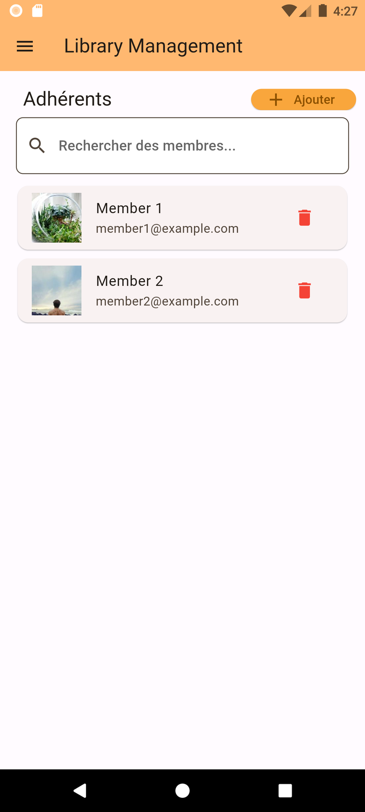
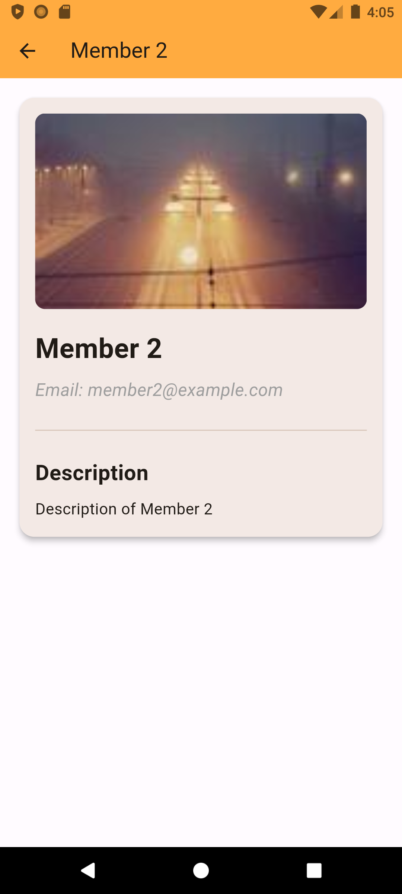
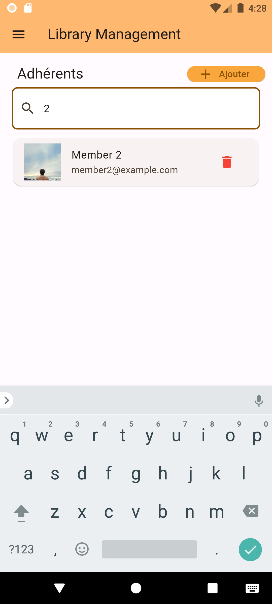
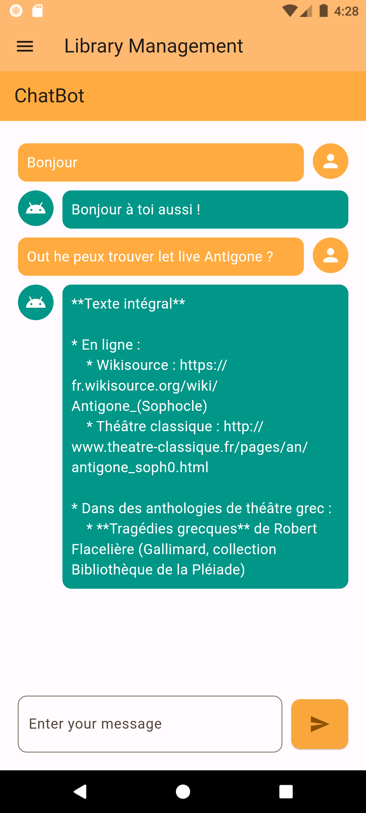

#  Library Management System



## Introduction

This project is a **Library Management System** developed using Flutter. It allows users to manage books and members, add comments and ratings, and utilize a chatbot for assistance.

Flutter is an open-source UI software development toolkit created by Google. It is used to develop cross-platform applications for Android, iOS, Linux, macOS, Windows, and the web from a single codebase.

### Features
- **Book Management**: Add, modify, and delete books.
- **Member Management**: Add, delete, and view member details.
- **Intelligent Chatbot**: Get help quickly using our chatbot powered by the Gemini API.
- **About Us Page**: Learn more about the library and its application.

## Project Structure

```bash
lib/
├── about_screen.dart          # About Us screen
├── book_detail_screen.dart    # Book details screen
├── books_screen.dart          # Books list and management screen
├── chatbot_screen.dart        # Chatbot screen
├── home_screen.dart           # Home screen
├── main.dart                  # Main entry point of the application
├── member_detail_screen.dart  # Member details screen
├── members_screen.dart        # Members list and management screen
```

### File Descriptions
- **main.dart**: The main entry point of the application, sets up `MaterialApp` and the main `Scaffold` with a `Drawer` for navigation.
- **home_screen.dart**: Defines the home screen with a welcoming UI using a gradient and feature cards.
- **books_screen.dart**: Manages the display of the book list, and allows adding, deleting, and viewing details of books.
- **book_detail_screen.dart**: Displays detailed information about a selected book, including comments and ratings from users.
- **members_screen.dart**: Manages the display of the member list, and allows adding, deleting, and viewing details of members.
- **member_detail_screen.dart**: Displays detailed information about a selected member, including an image and a description.
- **chatbot_screen.dart**: Manages the chatbot functionality, using the Gemini API to respond to user questions.
- **about_screen.dart**: Provides details about the application and the library.

## Screenshots

### Home Screen



### Book Management




### Member Management




### Chatbot


### About Us


## Note
> This is a Flutter project created by **EL MOUADDIBE Zaid** for Mobile Exam at ENSET Mohammadia | 28/05/2024